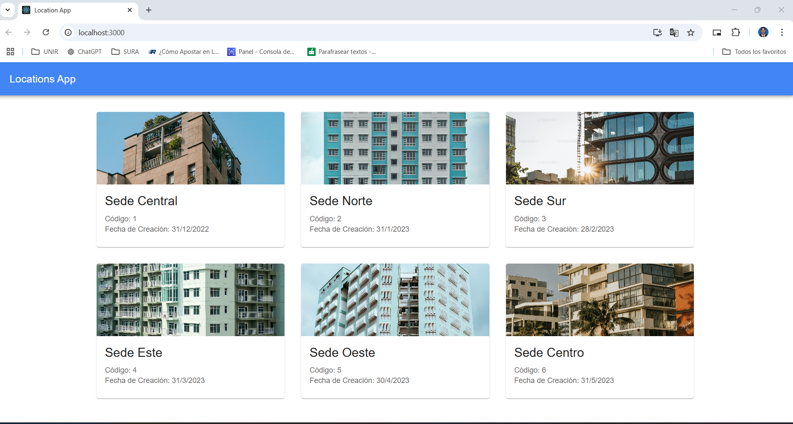

# Frontend Application - React with TypeScript

This project is the frontend implementation of a technical test for a Full Stack Developer role. The frontend is built with **React** and **TypeScript** and consumes an API endpoint to display a list of locations with responsive styling provided by **Material UI**.

---

## Features

- Fetches data from the backend endpoint `/api/locations` using an API Key for authentication.
- Displays a list of locations including:
  - Code (ID)
  - Name
  - Image (URL)
  - Creation Date
- Fully responsive and styled using Material UI components such as `Card`, `Typography`, and `Grid`.
- Implements best practices in React with TypeScript for clean and maintainable code.
- Unit tests ensure the correct rendering of the list and successful API integration.

---

## Requirements

- Node.js (version 14 or higher)
- NPM or Yarn
- API endpoint `/api/locations` accessible with a valid API Key

---

## Installation and Setup

1. Clone the repository:
2.npm install
3.npm start

